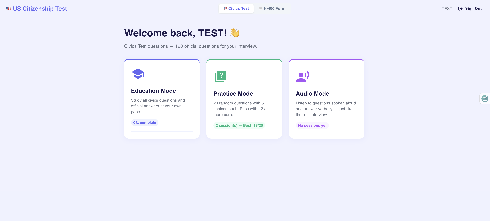
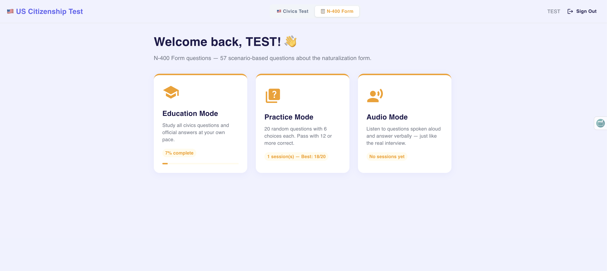

# sitezenshipApp

A lightweight citizenship test web application built with React, TypeScript, Node.js, Express, and MongoDB.

## What this app does

- Presents multiple question sets for citizenship study and practice.
- Supports login, registration, progress tracking, and practice modes.
- Includes audio and study modes for better learning.
- Stores question progress and user completion data on the server.

## Key features

- Full-stack architecture with a React client and Express server.
- Authentication and progress endpoints implemented in `server/`.
- Clear project documentation organized under `docs/`.
- Screenshot assets stored in `data/` for quick visuals.

## Getting started

1. Install dependencies:
   ```bash
   npm install
   cd client && npm install
   ```
2. Start the server and client in separate terminals:
   ```bash
   npm run dev
   ```
3. Open the app locally in your browser at `http://localhost:5173`.

## Project structure

- `client/` – React TypeScript application and UI components.
- `server/` – Express server, routes, middleware, and models.
- `data/` – application data and screenshot assets.
- `docs/` – moved Markdown documentation files and planning notes.

## Documentation

All supporting documentation files are now stored in `docs/`:

- `docs/00_START_HERE.md`
- `docs/COMMANDS_REFERENCE.md`
- `docs/DEPLOYMENT_CHECKLIST.md`
- `docs/E2E_ARCHITECTURE_DIAGRAMS.md`
- `docs/E2E_IMPLEMENTATION_SUMMARY.md`
- `docs/E2E_MASTER_INDEX.md`
- `docs/E2E_QUICK_REFERENCE.md`
- `docs/E2E_README.md`
- `docs/E2E_TESTING_SETUP.md`
- `docs/FILE_STRUCTURE.md`
- `docs/IMPLEMENTATION_COMPLETE.md`
- `docs/Questions.md`
- `docs/WORKFLOW_EXECUTION_FLOW.md`
- `docs/COMPLETION_REPORT.md`

## Screenshots

Screenshots for the app are available in `data/`:





## Notes

Keep the root `README.md` as the main entry point for the project. All additional documentation and implementation planning is stored in `docs/`.
